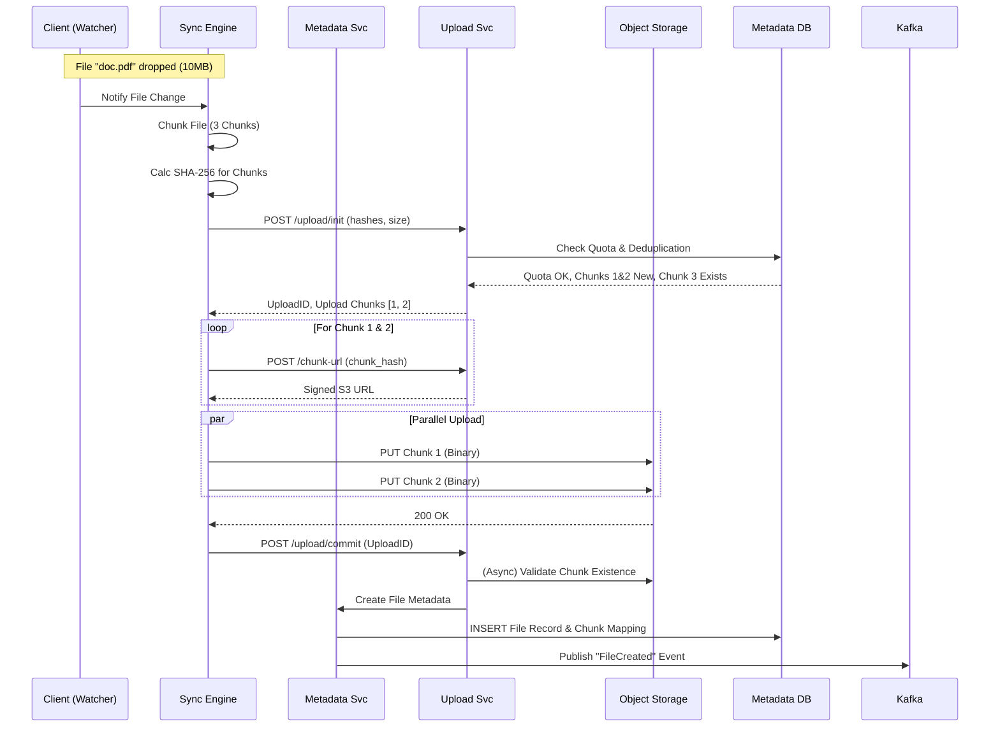

# Lecture 18: Distributed Storage Platform System Design

> **Lecture:** 18  
> **Topic:** System Design  
> **Application:** Google Drive, Dropbox, OneDrive  
> **Scale:** Millions of Users, Billions of Files (Petabytes of Data)  
> **Difficulty:** Very Hard (Client-Side Complexity + Distributed Sync)  
> **Previous:** [[Lecture-17-Payment-Gateway-System-Design|Lecture 17: Payment Gateway System Design]]

---

<br>

## 1. Introduction

Designing a distributed cloud storage platform like **Google Drive** or **Dropbox** is one of the most complex system design problems. Unlike typical web applications where complexity lies in the backend, here a significant portion of the complexity resides in the **Client Application** (Desktop/Mobile) handling file synchronization, chunking, and conflict resolution.

### **What is a Distributed Storage Platform?**
It is a service that allows users to:
1.  Store files in the cloud (reliably and securely).
2.  Synchronize files across multiple devices automatically.
3.  Share files with others.
4.  Access files from anywhere.

---

<br>

## 2. Requirement Gathering

### 2.1 Functional Requirements

1.  **User Onboarding:** Users should be able to create an account and sign up/sign in.
2.  **File Upload:**
    *   Users can upload files, photos, videos, documents.
    *   Support for **large files** (GBs to TBs).
    *   Support for folder structures (nested directories).
3.  **File Download:** Users can download files on demand from any device.
4.  **Automatic Synchronization (Sync):**
    *   If a user updates a file on Device A, it should automatically update on Device B, C, etc.
    *   This includes adds, edits, deletes, and renames.
5.  **File Sharing:**
    *   Users can share files/folders with specific users.
    *   Granular permissions (Read-Only, Edit/Write).
6.  **Directory Management:** Create, delete, move, and rename directories.
7.  **Storage Quota:** Service must enforce storage limits (e.g., 15GB free tier).
8.  **Offline Support:** Users can modify files offline; changes sync when back online.

### 2.2 Non-Functional Requirements

1.  **Scalability:**
    *   **Traffic:** Millions of Daily Active Users (DAU).
    *   **Storage:** Exabytes of data.
    *   **Throughput:** High write/read throughput.
2.  **Availability vs Consistency (CAP Theorem):**
    *   **Syncing:** **High Availability (AP)**. We prefer the system to be up and accept uploads. Synchronization can be *eventually consistent* (seconds of delay is acceptable).
    *   **Metadata:** **strong Consistency (CP)**. If I grant permission, it must be immediate. If I delete a file, it shouldn't be accessible.
    *   **Conflict Resolution:** Needs robust logic (e.g., "last write wins" or creating copies).
3.  **Reliability & Durability:**
    *   **Zero Data Loss:** Files must be replicated. Durability is non-negotiable (e.g., 99.999999999% durability).
4.  **Performance (Latency):**
    *   **Upload/Download:** Limited by network bandwidth, but system overhead should be minimal.
    *   **Sync Latency:** Should feel "real-time" to the user.
5.  **Security:** Encryption at rest and in transit.

---

<br>

## 3. Core Entities & Estimation

### 3.1 Core Entities

| Entity | Description |
| :--- | :--- |
| **User** | Account holder authenticated in the system. |
| **File** | The actual binary data (Blob). |
| **Metadata** | Information about the file (Name, Size, Type, Path, Owner). |
| **Folder** | A virtual grouping mechanism (Metadata only). |
| **Chunk** | A piece of a file. Large files are split into smaller blocks. |
| **Version** | Tracks changes to files over time. |
| **Permission** | Access control list (ACL) for sharing. |
| **Device/Client** | The physical device syncing data. |

### 3.2 Capacity Estimation (Back-of-the-Envelope)

*   **Users:** 500 Million Total, 100 Million DAU.
*   **Average Storage:** 10 GB per user.
*   **Total Storage:** 500M * 10GB = **5 Exabytes (EB)**.
*   **QPS (Queries Per Second):**
    *   Assume 1 user syncs 5 files/day.
    *   100M * 5 = 500M request/day.
    *   ~6,000 QPS average (Metadata).
    *   **Peak QPS:** ~12,000 - 15,000 QPS.

---

<br>

## 4. API Design

The API design here is unique because we separate **Control Plane** (Metadata) from **Data Plane** (File Chunks).

### 4.1 Metadata APIs (REST)

**1. Create Folder**
```http
POST /v1/folders
Authorization: Bearer <token>
```
```json
{
  "name": "Vacation Photos",
  "parent_folder_id": "root_123"
}
```

**2. Get Folder Content (List Files)**
```http
GET /v1/folders/{folder_id}/content
Authorization: Bearer <token>
```
*Response:* List of files and sub-folders with metadata.

**3. Get File Metadata by ID**
```http
GET /v1/files/{file_id}/metadata
```

**4. Rename/Move File**
```http
PUT /v1/files/{file_id}
```
```json
{
  "name": "NewName.jpg",
  "parent_folder_id": "new_folder_456"
}
```

### 4.2 File Upload APIs (Complex Flow)

**1. Initiate Upload**
```http
POST /v1/files/upload/init
```
```json
{
  "filename": "movie.mp4",
  "size": 2147483648,  // 2 GB
  "parent_folder_id": "folder_123",
  "checksum": "final_file_hash_sha256"
}
```
*Response:*
```json
{
  "upload_id": "upload_session_abc",
  "chunk_size": 4194304, // 4MB
  "existing_chunks": [index_1, index_5] // For resumes/deduplication
}
```

**2. Get Signed URL for Chunk**
```http
POST /v1/files/upload/chunk-url
```
```json
{
  "upload_id": "upload_session_abc",
  "chunk_index": 0,
  "chunk_hash": "hash_of_chunk_0"
}
```
*Response:*
```json
{
  "signed_url": "https://s3.aws.com/bucket/chunk_xyz?signature=..."
}
```

**3. Commit Upload**
```http
POST /v1/files/upload/commit
```
```json
{
  "upload_id": "upload_session_abc"
}
```

---

<br>

## 5. High-Level Design (HLD)

The architecture is split into the **Client Side** (complex logic) and the **Server Side** (complex scale).

### 5.1 Architecture Diagram

```ascii
                                       [Cloud Storage / S3]
                                               ▲
                                               │ (Direct Upload/Download)
    ┌─────────────────────────┐                │
    │      CLIENT DEVICE      │        ┌───────┴───────┐
    │ ┌─────────────────────┐ │        │ BLOCK SERVICE │ (Chunk Management)
    │ │     Watcher         │ │        └───────┬───────┘
    │ └─────────┬───────────┘ │                │
    │ ┌─────────▼───────────┐ │        ┌───────▼───────┐
    │ │     Chunker         │ ├───────►│  API GATEWAY  │◄────────────┐
    │ └─────────┬───────────┘ │        └───────┬───────┘             │
    │ ┌─────────▼───────────┐ │                │                     │
    │ │     Indexer         │ │        ┌───────▼───────┐      ┌──────▼───────┐
    │ │   (Internal DB)     │ ├───────►│ METADATA SVC  │      │ NOTIFICATION │
    │ └─────────┬───────────┘ │        └───────┬───────┘      │   SERVICE    │
    │ ┌─────────▼───────────┐ │                │              └──────▲───────┘
    │ │     Sync Engine     │ │        ┌───────▼───────┐             │
    │ └─────────────────────┘ │        │  METADATA DB  │      ┌──────┴───────┐
    └─────────────────────────┘        └───────────────┘      │ MESSAGE Q    │
                                                              │   (Kafka)    │
                                                              └──────────────┘
```

### 5.2 Key Components

#### 1. Client Application
The client is not a dumb terminal; it's a sophisticated engine.
*   **Watcher:** Monitors local OS file system hooks (e.g., `inotify` on Linux, `FSEvents` on Mac) for file changes.
*   **Chunker:** Splits large files into small, fixed-size pieces (e.g., 4MB). Computes SHA-256 hash for each chunk.
*   **Indexer (Internal DB):** An embedded database (SQLite) on the client. It tracks the state of files, chunks, versions, and sync status ("Synced", "Pending", "Syncing").
*   **Sync Engine:** Orchestrates uploads/downloads. Handles network retries and delta syncs.

#### 2. Metadata Service
*   Manages file versioning, directory structure, and permissions.
*   Does **not** store the actual file bytes.
*   Stores mappings: `FileID -> [ChunkID_1, ChunkID_2, ...]`.

#### 3. Block Service (Upload/Download)
*   Manages the cloud storage (S3/Blob).
*   Generates Pre-signed URLs.
*   Handles deduplication logic.

#### 4. Notification Service
*   Sends real-time updates to connected devices (Push Model) so they know a file changed.
*   Uses Long Polling or WebSockets.

---

<br>

## 6. Deep Dive & Low-Level Design

### 6.1 The "Chunking" Strategy

File storage is all about chunks. Why?
1.  **Resumability:** If a 10GB download fails at 99%, we only retry the last chunk.
2.  **Parallelism:** We can upload/download multiple chunks simultaneously.
3.  **Deduplication:** Only store unique chunks.
4.  **Delta Sync:** If a user modifies 1 byte in a 2GB file, we only upload the *one* chunk that changed, not the whole file.

**Chunk Size:** ~4MB is industry standard (Dropbox uses 4MB).
**Hashing:** SHA-256 Checksum. Uniquely identifies chunk content.

**Example:**
*File:* `video.mp4` (10MB)
*   Chunk 1 (4MB) -> Hash: `A1B2`
*   Chunk 2 (4MB) -> Hash: `C3D4`
*   Chunk 3 (2MB) -> Hash: `E5F6`

---

### 6.2 Deduplication (Space Optimization)

Since we are a "Distributed Storage" platform, many users upload the same files (e.g., viral videos, popular PDFs, software installers).

**How it works:**
1.  **Content Addressable Storage (CAS):** The chunk's name in S3 is its Hash.
2.  **Upload Flow:**
    *   User A uploads `cat.jpg`. Chunks: `HASH_XYZ`.
    *   System saves `HASH_XYZ` to S3.
    *   User B uploads `cat_copy.jpg`.
    *   Client calculates hash -> `HASH_XYZ`.
    *   Client sends `init` request with hash.
    *   Server checks DB: "Do I have `HASH_XYZ`?" -> **YES**.
    *   Server response: "Upload Complete. No need to send data."
    *   **Result:** 0 bytes uploaded, S3 storage used once, but two users "own" the file.

---

### 6.3 Detailed File Upload Flow (The 6 Steps)

This is the most critical flow to implement correctly.



#### Step Breakdown:
1.  **Validation:** Check User Quota.
2.  **Optimization:** Check if chunks already exist (Deduplication).
3.  **Security:** Generate Signed URLs (Client uploads directly to S3. Data never goes through our API servers to save bandwidth).
4.  **Persistence:** S3 stores chunks. Metadata DB stores structure.
5.  **Notification:** Trigger sync for other devices.

---

### 6.4 Metadata Database Schema

We cannot use S3 for file listings because S3 listing is slow and purely flat. We need a DB to simulate a hierarchical file system.

**Database Choice:**
*   **Relational (PostgreSQL/MySQL):** Strong consistency (ACID) is crucial for file structure. Good for Metadata.
*   **NoSQL (Cassandra/DynamoDB):** Can be used for the chunk mapping table due to huge scale.

#### **1. Users Table**
```sql
CREATE TABLE users (
    user_id UUID PRIMARY KEY,
    name VARCHAR(255),
    email VARCHAR(255),
    total_quota BIGINT DEFAULT 15000000000, -- 15GB
    used_quota BIGINT DEFAULT 0,
    created_at TIMESTAMP
);
```

#### **2. File Metadata Table (The Virtual File System)**
This table represents the directory tree.
```sql
CREATE TABLE files (
    file_id UUID PRIMARY KEY,
    owner_id UUID,
    parent_folder_id UUID, -- NULL if root
    name VARCHAR(255),
    is_folder BOOLEAN,
    size BIGINT,
    version INT DEFAULT 1,
    checksum VARCHAR(256),
    created_at TIMESTAMP,
    is_deleted BOOLEAN, -- Soft delete (Trash)
    INDEX(owner_id, parent_folder_id) -- Speed up directory listing
);
```

#### **3. Chunks Table (Deduplication Store)**
Tracks unique chunks that exist in S3.
```sql
CREATE TABLE chunks (
    chunk_hash VARCHAR(256) PRIMARY KEY, -- SHA-256
    bucket_path VARCHAR(512),
    size INT,
    ref_count INT DEFAULT 1 -- For garbage collection
);
```

#### **4. File_Version_Chunks_Map (The Glue)**
Connects a specific version of a file to its chunks.
```sql
CREATE TABLE file_chunks (
    file_id UUID,
    version INT,
    chunk_index INT, -- 0, 1, 2...
    chunk_hash VARCHAR(256),
    PRIMARY KEY (file_id, version, chunk_index)
);
```

---

### 6.5 The Sync Flow

How do other devices get the file?

#### **Push vs Pull**
*   **Pull:** Client polls server every minute. *Inefficient.*
*   **Push:** Server notifies client via WebSocket/Notification. *Real-time.*

**Design:** Hybrid.
1.  **Notification:** Server sends a lightweight ping via WebSocket to connected clients: *"Change in Folder ID 123"*.
2.  **Pull Metadata:** Client wakes up, calls `GET /changes?since=timestamp`.
3.  **Download:** Client sees new file metadata, requests chunks, downloads from S3.

#### **Handling Offline Conflicts**
*   User A edits `doc.txt` offline (v1 -> v2).
*   User B edits `doc.txt` online (v1 -> v3).
*   User A comes online.
*   System detects conflict (Parent version determines validity).
*   **Strategy:** Create a "Conflicted Copy" (e.g., `doc (User A's conflicted copy).txt`). We generally do not merge text files automatically.

---

<br>

## 7. Scalability & Optimizations

### 7.1 Metadata Partitioning (Sharding)
The Metadata DB will grow huge (billions of rows).
*   **Sharding Key:** `User_ID` is strictly strongly safe because normally users only search/modify their own files. Sharing adds complexity, but usually, we shard by `File_ID` or `Account_ID`.
*   **Hot Spotting:** Not usually an issue unless one user has 100M files (unlikely).

### 7.2 Async Processing (Post-Processing)
When a file is uploaded, many background jobs run:
1.  **Virus Scan:** Check for malware.
2.  **Thumbnail Generation:** For images/videos.
3.  **PDF/Doc Preview:** Convert to lightweight format.
4.  **Indexing:** For full-text search.

**Pattern:** S3 Event -> SQS/Kafka -> Lambda/Worker -> Update Metadata.

### 7.3 Cache (Redis)
*   **Session Cache:** For Upload IDs and offsets during active uploads.
*   **Metadata Cache:** Store recently accessed directory listings.
*   **Hot Chunks:** If using a CDN (though typically S3 is sufficient).

### 7.4 Cold Storage (Cost Saving)
*   User data follows a "temperature" curve. Recent files are hot. Old files are cold.
*   Move chunks not accessed for 6 months to **S3 Glacier** or **Deep Archive** to save costs.
*   If user requests download, restore from Glacier (takes time or higher cost).

---

<br>

## 8. Client-Side Complexities (The "Watcher" Service)

The client app is effectively a state machine.

**Code Logic (Conceptual Java):**

```java
public class WatcherService {
    
    // Monitors local file system
    public void onFileChange(File file) {
        if (file.isDirectory()) return;

        // 1. Check Local Index (SQLite)
        LocalRecord record = database.get(file.getPath());
        
        // 2. Hash the file
        String newHash = computeHash(file);
        
        // 3. Deduplication Check (Did the content actually change?)
        if (record != null && record.getHash().equals(newHash)) {
            return; // False alarm (timestamp changed but content didn't)
        }

        // 4. Trigger Sync
        syncEngine.addToQueue(new UploadTask(file));
    }
}
```

```java
public class SyncEngine {
    
    public void processUpload(File file) {
        // 1. Chunking
        List<Chunk> chunks = chunker.split(file);
        
        // 2. Init Request
        InitResponse meta = backend.initUpload(file.getName(), chunks.getHashes());
        
        // 3. Differential Upload
        for (int i = 0; i < chunks.size(); i++) {
            // Only upload if server says it's missing (existing_chunks list)
            if (!meta.getExistingChunks().contains(i)) {
                 String url = backend.getSignedUrl(meta.getUploadId(), i);
                 s3Client.put(url, chunks.get(i).getData());
            }
        }
        
        // 4. Commit
        backend.commit(meta.getUploadId());
        
        // 5. Update Local SQLite
        localDb.updateStatus(file, "SYNCED");
    }
}
```

---

<br>

## 9. Interview Q&A

### Q1: How do you handle a Resume Upload scenario?
**Ans:** The Client keeps track of the `UploadID`. If network fails, the client retries `init` with the same file hash. The server looks up the `UploadID` in **Redis**. It returns a list of chunk indexes that are already present in S3. The client only uploads the missing chunks.

### Q2: How does "Trash" or "Recycle Bin" work?
**Ans:** It's purely metadata. We set `is_deleted = true` in the Metadata DB. We do not delete the chunks from S3 immediately.
A background **Garbage Collector (GC)** runs periodically (e.g., every 30 days). It checks files marked `is_deleted` > 30 days. It deletes the record and decrements the `ref_count` in the `Chunks` table. If `ref_count == 0`, the S3 object is physically deleted.

### Q3: Why use S3 and not store files in the Database?
**Ans:** Databases (RDBMS) are optimized for structured queries, row locking, and indexing. They perform poorly with large BLOBs (Binary Large Objects). S3 (Object Storage) is cheaper, infinitely scalable, and designed for write-once-read-many binary data.

### Q4: How do you secure the files?
**Ans:**
1.  **At Rest:** S3 Server-Side Encryption (SSE-S3 or KMS).
2.  **In Transit:** HTTPS/TLS 1.3.
3.  **Authorization:** Signed URLs allow temporary access to a specific object without exposing the bucket credentials.

### Q5: What happens if two users upload the same file at the exact same time?
**Ans:**
*   Both calculate the same hash.
*   Both request `init`.
*   Server sees identical hashes. Deduplication logic handles it.
*   Even if they upload chunks in parallel, S3 overwrites (idempotent) or we check existence before write.
*   Both users get a metadata entry pointing to the same chunks.

---

<br>

## 10. Summary

### Checklist for Success
*   ✅ **Metadata !== Data:** Separated architecture.
*   ✅ **Chunking:** Split files for speed, resume, and dedup.
*   ✅ **Client Intelligence:** Local DB, Watcher, Delta Sync.
*   ✅ **Security:** Pre-signed URLs.
*   ✅ **Efficiency:** Metadata sync via Push notifications; Data transfer via S3.
*   ✅ **Reliability:** ACKs and Commits.

This design scales to accommodate the massive requirements of a global storage platform while maintaining a responsive user experience.
